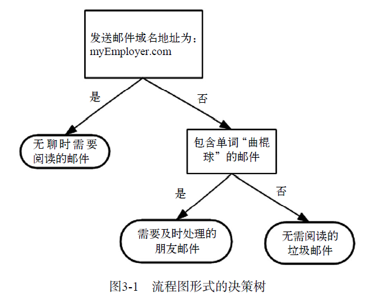

# 决策树（分类）

## 基本工作原理
> 如下图所示流程图就是一个决策树。
> + 正方形代表判断模块（decision block），椭圆形代表终止模块（terminating block），表示已经得出结论，可以终止运行。
> + 从判断模块引出的左右箭头称作分支（branch），它可以到达另一个判断模块或者终止模块。

> 下图构造了一个假想的邮件分类系统
> + 它首先检测发送邮件域名地址。
    * 如果地址为myEmployer.com，则将其放在分类“无聊时需要阅读的邮件”中。
    * 如果邮件不是来自这个域名:
        * 则检查邮件内容里是否包含单词曲棍球，
            * 如果包含则将邮件归类到“需要及时处理的朋友邮件”;
            * 如果不包含则将邮件归类到“无需阅读的垃圾邮件”。

> 1. 第2章介绍的k-近邻算法可以完成很多分类任务，但是它最大的缺点就是无法给出数据的内在含义，决策树的主要优势就在于数据形式非常容易理解。
> 2. 决策树很多任务都是为了数据中所蕴含的知识信息，因此决策树可以使用不熟悉的数据集合，并从中提取出一系列规则，机器学习算法最终将使用这些机器从数据集中创造的规则。

## 特点
> * 优点: 计算复杂度不高，输出结果易于理解，对中间值的缺失不敏感，可以处理不相关特征数据。
> * 缺点：可能会产生过度匹配问题。
> * 使用数据范围：数值型和标称型。

## 一般流程
> 1. 收集数据 ：可以使用任何方法
> 2. 准备数据 : 树构造算法只适用于标称型数据，因此数值型数据必须离散化。
> 3. 分析数据 : 可以使用任何方法，构造树完成之后，我们应该检查图形是否符合预期。
> 4. 训练算法 ：构造树的数据结构。
> 5. 测试算法 ：使用经验树计算错误率。
> 6. 使用算法 ：此步骤可以适用于任何监督学习算法，而使用决策树可以更好地理解数据的内在含义。

#### 注意：决策树需要解决第一个问题就是当前数据集上`哪个特征在划分数据分类时起决定性作用`，找到一个合适的特征评估指标，对每个特征进行评估，进而构建决策树。本章将采用ID3算法构建决策树，基于香农熵和信息增益进行特征的选择。  
#### 在划分数据集之前之后信息发生的变化称为信息增益，知道如何计算信息增益，我们就可以计算每个特征值划分数据集获得的信息增益，获得信息增益最高的特征就是最好的选择。  
> 熵定义为信息的期望值，在明晰这个概念之前，我们必须知道信息的定义。如果待分类的事务可能划分在多个分类之中，则样本集合D中第i类样本$ x_i $的信息定义为
> $$ l(x_i)=-log_2p(x_i) $$
> 其中$ p(x_i) $是选择该分类所占的比例。

> 为了计算熵，我们需要计算所有类别所有可能值包含的信息期望值，通过下面的公式得到：
> $$ H(D) = -\sum^{n}_{i = 1}{p(x_i)log_2p(x_i)} $$
> 熵的值越小，则样本集合的纯度越高。

> 信息增益在决策树算法中是用来选择特征的指标，信息增益越大，则这个特征的选择性越好。计算特征a对样本集D进行划分所获得的信息增益为：
> $$ Gain(D,a) = H(D) - \sum_{v=1}^{V}{\frac{D^v}{D}H(D^v)} $$
> 其中：V表示依据特征a对样本集D划分后，获得的总共类别数量；$D^v $表示每一个新类别中样本数量。

#### 事实上，信息增益准则对可取值数目较多的特征有所偏好，为了减少这种偏好可能带来的不利影响，C4.5决策树算法使用了“增益率”。CART分类树算法使用基尼系数来代替信息增益比，基尼系数代表了模型的不纯度，基尼系数越小，则不纯度越低，特征越好。这两种算法将在后面的学习中继续介绍。本章只介绍使用信息增益的ID3算法。